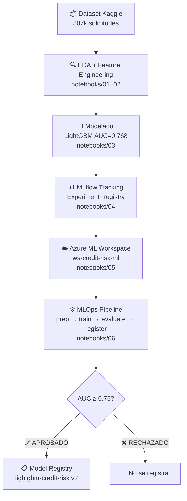
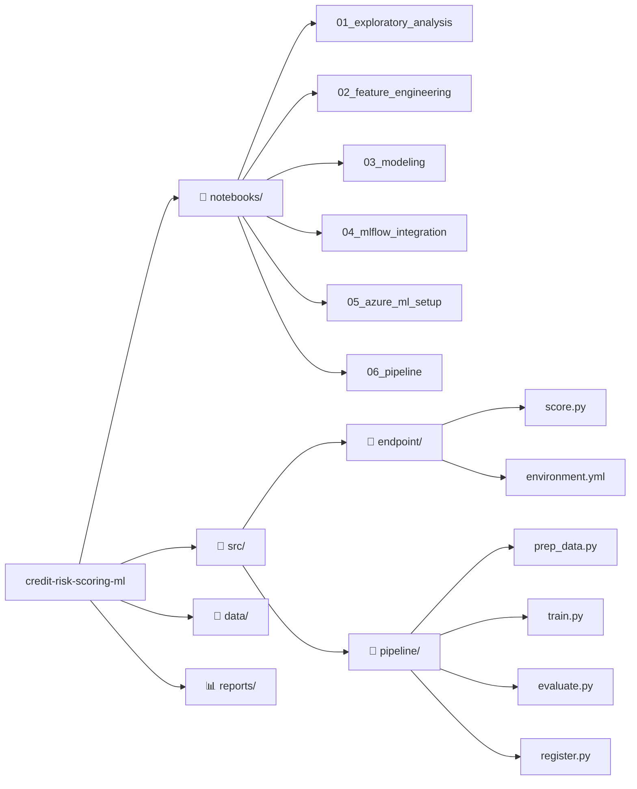
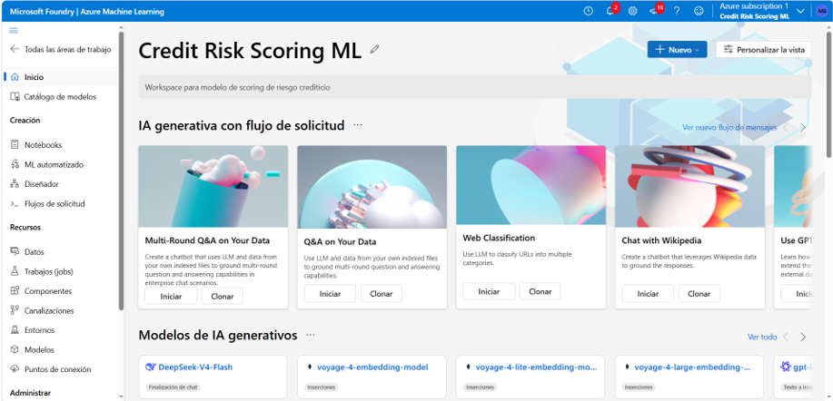
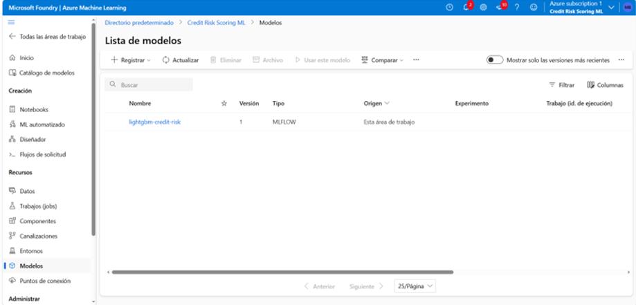
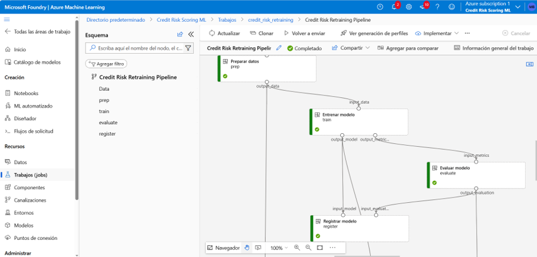
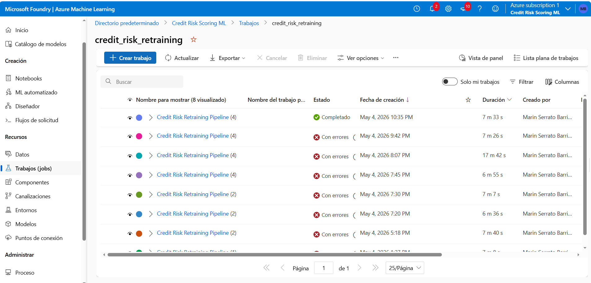

# 🏦 Credit Risk Scoring ML

> Sistema MLOps end-to-end para scoring de riesgo crediticio en originación de crédito.
> Reduce cartera morosa mediante predicción de probabilidad de incumplimiento (PD).


🚀 **[Ver Dashboard en Vivo](https://credit-risk-scoring-marin.streamlit.app)**

---

## 📋 Índice

- [Problema de Negocio](#problema-de-negocio)
- [Solución](#solución)
- [Resultados](#resultados)
- [Arquitectura](#arquitectura)
- [Stack Tecnológico](#stack-tecnológico)
- [Estructura del Proyecto](#estructura-del-proyecto)
- [Pipeline MLOps](#pipeline-mlops)
- [Instalación](#instalación)
- [Autor](#autor)

---

## 🎯 Problema de Negocio

En originación de crédito, **el costo de un falso negativo es asimétrico**:
aprobar a un cliente que incumplirá genera pérdidas directas de capital,
mientras que rechazar a un buen cliente solo genera costo de oportunidad.

**Contexto:**
- Cartera morosa promedio en microfinanzas México: 8-12%
- Costo de una NPL (Non-Performing Loan): 3-5x el monto del crédito
- Regulación CNBV exige modelos explicables y auditables

**Pregunta de negocio:**
> ¿Cómo predecir, al momento de la solicitud, qué clientes tienen
> alta probabilidad de incumplir en los primeros 12 meses?

---

## 💡 Solución

Sistema de scoring crediticio con dos modelos complementarios:

| Modelo | Propósito | AUC |
|--------|-----------|-----|
| **LightGBM** | Scoring principal de alta precisión | **0.768** |
| **Scorecard Logístico** | Modelo regulatorio explicable (WoE) | 0.74 |

El sistema asigna una **probabilidad de incumplimiento (PD)** entre 0 y 1
a cada solicitante, permitiendo definir umbrales de aprobación por
segmento de riesgo.

---

## 📊 Resultados

### Modelo LightGBM (Producción)

| Métrica | Valor |
|---------|-------|
| AUC ROC | **0.768** |
| Dataset | 307,511 solicitudes |
| Features | 65 variables |
| Tasa de mora en datos | 8.1% |
| Framework | LightGBM 4.3.0 |

### Pipeline de Reentrenamiento

| Paso | Estado | Descripción |
|------|--------|-------------|
| Preparar datos | ✅ | Limpieza y validación |
| Entrenar modelo | ✅ | LightGBM con hiperparámetros optimizados |
| Evaluar calidad | ✅ | Gate AUC ≥ 0.75 — **APROBADO (0.7675)** |
| Registrar modelo | ✅ | Nueva versión en Azure ML Model Registry |

---


## 🏗️ Arquitectura



---

## 🛠️ Stack Tecnológico

### Machine Learning
- **LightGBM 4.3.0** — modelo principal de scoring
- **scikit-learn** — preprocessing, métricas, validación
- **pandas / numpy** — manipulación de datos

### MLOps
- **MLflow 2.19.0** — experiment tracking y model registry local
- **Azure ML SDK 1.32.0** — workspace, model registry en nube
- **Azure ML Pipelines** — reentrenamiento automatizado

### Infraestructura
- **Azure Machine Learning** — workspace `ws-credit-risk-ml`
- **Azure Blob Storage** — almacenamiento de datos y artefactos
- **Azure Compute Cluster** — `cpu-cluster-cr` (Standard_DS2_v2)

### Desarrollo
- **Python 3.10** — lenguaje principal
- **Jupyter Notebooks** — exploración y documentación
- **Git / GitHub** — control de versiones

---

## 📁 Estructura del Proyecto



---

## ⚙️ Pipeline MLOps

El pipeline de reentrenamiento automatizado ejecuta 4 pasos en Azure ML:

Nueva data
│
▼
prep_data.py ──► train.py ──► evaluate.py ──► register.py
│                │              │               │
Limpieza        LightGBM       AUC ≥ 0.75?    Nueva versión
validación      AUC=0.7675     APROBADO ✅    en Registry

**Gate de calidad:** el modelo solo se registra si AUC ≥ 0.75.
Esto previene el registro automático de modelos degradados.

---

## 🚀 Instalación

```bash
# Clonar el repositorio
git clone https://github.com/MarinoSB577/credit-risk-scoring-ml.git
cd credit-risk-scoring-ml

# Crear entorno conda
conda create -n credit-risk python=3.10
conda activate credit-risk

# Instalar dependencias
pip install -r requirements.txt

# Iniciar Jupyter
jupyter notebook
```

---

## 📸 Evidencia en Azure ML

### Workspace


### Model Registry


### Pipeline Completado


### Historial de Experimentos



---

## 👤 Autor

**Marín Serrato Barrios**

Actuario y Maestro en Ciencias en Informática | Analytics Manager | Riesgo Crediticio

14+ años de experiencia en BI/Analytics en microfinanzas,
retail y consultoría. Especialista en modelos de crédito
y sistemas MLOps para instituciones financieras mexicanas.

[](https://github.com/MarinoSB577)

---

*Proyecto desarrollado como parte del portfolio de Analytics & MLOps*
*Dataset: Home Credit Default Risk — Kaggle*