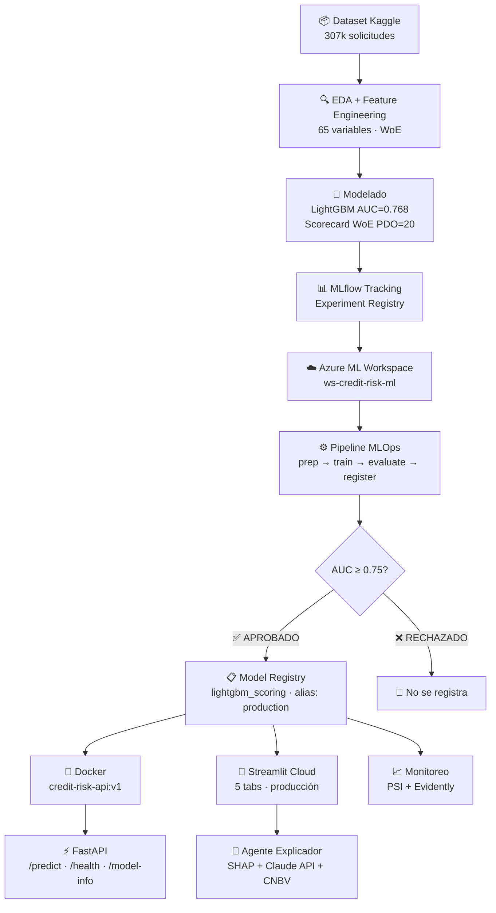

# 🏦 Credit Risk Scoring ML

> Sistema MLOps end-to-end para scoring de riesgo crediticio en originación de crédito.
> Reduce cartera morosa mediante predicción de probabilidad de incumplimiento (PD).


🚀 **[Ver Dashboard en Vivo](https://credit-risk-scoring-marin.streamlit.app)** &nbsp;|&nbsp; 📖 **[API Docs](http://localhost:8000/docs)**

---

## 📋 Índice

- [Problema de Negocio](#problema-de-negocio)
- [Solución](#solución)
- [Resultados](#resultados)
- [Arquitectura](#arquitectura)
- [Stack Tecnológico](#stack-tecnológico)
- [Dashboard — 5 Tabs](#dashboard--5-tabs)
- [API REST](#api-rest)
- [Monitoreo de Drift](#monitoreo-de-drift)
- [Estructura del Proyecto](#estructura-del-proyecto)
- [Pipeline MLOps](#pipeline-mlops)
- [Instalación](#instalación)
- [Evidencia Azure ML](#evidencia-azure-ml)
- [Autor](#autor)

---

## 🎯 Problema de Negocio

En originación de crédito, **el costo de un falso negativo es asimétrico**:
aprobar a un cliente que incumplirá genera pérdidas directas de capital,
mientras que rechazar a un buen cliente solo genera costo de oportunidad.

**Contexto:**
- Cartera morosa promedio en microfinanzas México: 8-12%
- Costo de una NPL (Non-Performing Loan): 3-5x el monto del crédito
- Regulación CNBV exige modelos explicables y auditables

**Pregunta de negocio:**
> ¿Cómo predecir, al momento de la solicitud, qué clientes tienen
> alta probabilidad de incumplir en los primeros 12 meses?

---

## 💡 Solución

Sistema de scoring crediticio con dos modelos complementarios, agente explicador con IA y pipeline MLOps completo:

| Componente | Descripción | Estado |
|------------|-------------|--------|
| **LightGBM** | Scoring principal de alta precisión | ✅ Producción |
| **Scorecard Logístico WoE** | Modelo regulatorio explicable (PDO=20, base 600 pts) | ✅ Producción |
| **Agente Explicador** | SHAP + Claude API + chat conversacional con normativa CNBV | ✅ Producción |
| **API REST** | FastAPI + Docker — endpoint `/predict` con SHAP integrado | ✅ Producción |
| **Pipeline MLOps** | Azure ML — reentrenamiento automatizado con gate de calidad | ✅ Producción |
| **Monitoreo** | PSI + Evidently — detección automática de data drift | ✅ Implementado |

---

## 📊 Resultados

### Modelo LightGBM (Producción)

| Métrica | Valor |
|---------|-------|
| AUC ROC | **0.768** |
| Dataset | 307,511 solicitudes |
| Features | 65 variables |
| Tasa de mora en datos | 8.1% |
| Umbral óptimo | 0.59 |
| Framework | LightGBM 4.3.0 |

### Scorecard Logístico WoE

| Parámetro | Valor |
|-----------|-------|
| Método de escalamiento | PDO=20, odds 50:1 |
| Score base | 600 puntos |
| Rango de scores | 300 — 850 pts |
| AUC | 0.74 |

### Pipeline de Reentrenamiento Azure ML

| Paso | Estado | Descripción |
|------|--------|-------------|
| Preparar datos | ✅ | Limpieza y validación |
| Entrenar modelo | ✅ | LightGBM con hiperparámetros optimizados |
| Evaluar calidad | ✅ | Gate AUC ≥ 0.75 — **APROBADO (0.7675)** |
| Registrar modelo | ✅ | Nueva versión en Azure ML Model Registry |

---

## 🏗️ Arquitectura



---

## 🛠️ Stack Tecnológico

### Machine Learning
- **LightGBM 4.3.0** — modelo principal de scoring
- **optbinning** — Scorecard WoE con conversión a puntos PDO
- **SHAP 0.45** — explicabilidad por solicitud (top 3 variables)
- **scikit-learn** — preprocessing, métricas, validación
- **pandas / numpy** — manipulación de datos

### MLOps
- **MLflow 2.13.0** — experiment tracking y model registry local
- **Azure ML SDK** — workspace, model registry en nube
- **Azure ML Pipelines** — reentrenamiento automatizado con gate AUC ≥ 0.75

### Despliegue
- **FastAPI 0.111** — API REST con documentación Swagger UI automática
- **Docker** — contenedor portable `credit-risk-api:v1` (python:3.11-slim)
- **Streamlit Cloud** — dashboard interactivo en producción

### IA Generativa
- **Claude API (claude-sonnet-4-6)** — agente explicador con normativa CNBV embebida en prompt
- **SHAP + LLM** — justificaciones regulatorias auditables por solicitud
- **Chat conversacional** — memoria de contexto por sesión

### Calidad y Monitoreo
- **GitHub Actions** — CI/CD: lint (flake8) + tests (pytest) + docker build en cada push
- **pytest** — 5 tests unitarios con mocks del modelo
- **Evidently 0.7** — reportes HTML de data drift
- **PSI** — Population Stability Index por variable con umbrales automáticos

### Infraestructura
- **Azure Machine Learning** — workspace `ws-credit-risk-ml` (East US)
- **Azure Blob Storage** — datos y artefactos
- **Azure Compute Cluster** — Standard_DS2_v2, min_instances=0

---

## 📊 Dashboard — 5 Tabs

Accesible en: **[credit-risk-scoring-marin.streamlit.app](https://credit-risk-scoring-marin.streamlit.app)**

| Tab | Descripción |
|-----|-------------|
| **🎯 Scoring Individual** | Evalúa un solicitante: PD, score en puntos, decisión APROBAR/RECHAZAR/REVISAR |
| **📁 Portfolio** | Análisis de cartera: distribución de riesgo, concentración, mora esperada |
| **📈 Métricas del Modelo** | AUC, KS, Gini, curva ROC, matriz de confusión por umbral |
| **🤖 Agente Explicador** | SHAP + Claude API: justificación regulatoria + chat conversacional con memoria |
| **📋 Scorecard WoE** | Scorecard logístico con puntos por variable, compatible con auditoría CNBV |

---

## ⚡ API REST

### Correr con Docker

```bash
# Construir imagen
docker build -t credit-risk-api:v1 .

# Levantar contenedor
docker run -d -p 8000:8000 --name credit-risk-api credit-risk-api:v1

# Verificar servicio
curl http://localhost:8000/health
```

### Endpoints disponibles

| Método | Endpoint | Descripción |
|--------|----------|-------------|
| `GET` | `/health` | Estado del servicio y modelo cargado |
| `GET` | `/model-info` | Metadata: versión, AUC, features |
| `POST` | `/predict` | Evaluación crediticia completa |

### Ejemplo de request `/predict`

```bash
curl -X POST http://localhost:8000/predict \
  -H "Content-Type: application/json" \
  -d '{
    "EXT_SOURCE_2": 0.75,
    "DAYS_BIRTH": -14600,
    "DAYS_EMPLOYED": -3000,
    "AMT_CREDIT": 250000,
    "AMT_INCOME_TOTAL": 200000
  }'
```

### Ejemplo de respuesta

```json
{
  "probabilidad_incumplimiento": 0.08,
  "score_crediticio": 682,
  "decision": "APROBAR",
  "nivel_riesgo": "Bajo",
  "top_variables": [
    {"variable": "Score externo 2", "contribucion": -0.42, "direccion": "reduce riesgo"},
    {"variable": "Antigüedad laboral", "contribucion": -0.18, "direccion": "reduce riesgo"},
    {"variable": "Edad del solicitante", "contribucion": -0.11, "direccion": "reduce riesgo"}
  ],
  "mensaje": "Solicitud evaluada. PD=8.0%, Score=682 pts. Decisión: APROBAR."
}
```

Documentación interactiva disponible en `http://localhost:8000/docs` (Swagger UI).

---

## 📈 Monitoreo de Drift

El sistema incluye detección automática de data drift con dos herramientas complementarias:

### PSI — Population Stability Index

```bash
# Escenario drift leve
python scripts/monitoring/generate_drift_report.py --escenario leve

# Escenario drift severo
python scripts/monitoring/generate_drift_report.py --escenario severo
```

| PSI | Clasificación | Acción |
|-----|---------------|--------|
| < 0.10 | ✅ Estable | Modelo válido |
| 0.10 — 0.25 | ⚠️ Moderado | Monitorear de cerca |
| > 0.25 | ❌ Drift severo | Reentrenar modelo |

### Evidently

Genera reportes HTML con histogramas comparativos y Wasserstein distance por variable. Los reportes se guardan en `reports/drift/`.

---

## 📁 Estructura del Proyecto

```
credit-risk-scoring-ml/
├── notebooks/
│   ├── 01_exploratory_analysis.ipynb
│   ├── 02_feature_engineering.ipynb
│   ├── 03_modeling.ipynb
│   ├── 04_mlflow_integration.ipynb
│   ├── 05_azure_ml_setup.ipynb
│   ├── 06_pipeline.ipynb
│   └── 07_scorecard_woe.ipynb
├── src/
│   ├── api/                        ← FastAPI + Docker
│   │   ├── main.py
│   │   ├── schemas.py
│   │   ├── model_loader.py
│   │   └── requirements.txt
│   ├── pipeline/                   ← Azure ML pipeline
│   │   ├── prep_data.py
│   │   ├── train.py
│   │   ├── evaluate.py
│   │   └── register.py
│   └── endpoint/
├── dashboard/
│   ├── app.py                      ← Streamlit (5 tabs)
│   └── models/
│       ├── model.pkl               ← LightGBM producción
│       └── scorecard_woe.pkl       ← Scorecard logístico
├── scripts/
│   └── monitoring/
│       ├── simulate_production_data.py
│       └── generate_drift_report.py
├── tests/
│   └── test_api.py                 ← 5 tests unitarios (pytest)
├── data/
│   ├── processed/
│   └── production/
├── reports/
│   ├── drift/                      ← Reportes Evidently + CSVs PSI
│   └── screenshots/                ← Evidencia Azure ML
├── .github/
│   └── workflows/
│       └── ci.yml                  ← GitHub Actions CI/CD
├── Dockerfile
├── .dockerignore
└── README.md
```

---

## ⚙️ Pipeline MLOps

El pipeline de reentrenamiento automatizado ejecuta 4 pasos en Azure ML:

```
Nueva data
│
▼
prep_data.py ──► train.py ──► evaluate.py ──► register.py
│                │              │               │
Limpieza        LightGBM       AUC ≥ 0.75?    Nueva versión
validación      AUC=0.7675     APROBADO ✅    en Registry
```

**Gate de calidad:** el modelo solo se registra si AUC ≥ 0.75.
Previene el registro automático de modelos degradados.

### CI/CD con GitHub Actions

En cada `git push` a `master` se ejecuta automáticamente:

```
push → lint (flake8) → tests (pytest 5/5) → docker build
```

---

## 🚀 Instalación

```bash
# Clonar el repositorio
git clone https://github.com/MarinoSB577/credit-risk-scoring-ml.git
cd credit-risk-scoring-ml

# Crear entorno conda
conda create -n credit-risk python=3.11
conda activate credit-risk

# Instalar dependencias
pip install -r requirements.txt

# Correr dashboard localmente
cd dashboard
streamlit run app.py

# Correr API con Docker
docker build -t credit-risk-api:v1 .
docker run -d -p 8000:8000 --name credit-risk-api credit-risk-api:v1
```

---

## 📸 Evidencia Azure ML

### Pipeline Completado


### Model Registry


### Workspace


### Historial de Experimentos


---

## 👤 Autor

**Marín Serrato Barrios**

Actuario y Maestro en Ciencias en Informática | Analytics Manager | Riesgo Crediticio

14+ años de experiencia en BI/Analytics en microfinanzas, retail y consultoría.
Especialista en modelos de crédito y sistemas MLOps para instituciones financieras mexicanas.

[](https://github.com/MarinoSB577)

---

*Proyecto desarrollado como parte del portfolio de Analytics & MLOps*
*Dataset: Home Credit Default Risk — Kaggle*
