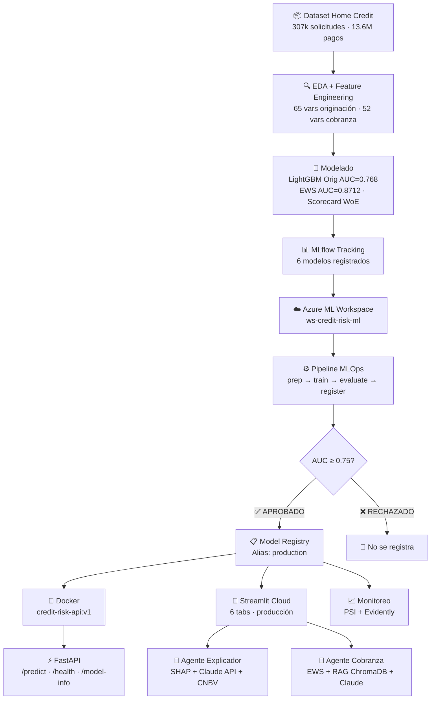

# 🏦 Credit Risk Scoring ML — Sistema Multi-Agente

> Sistema MLOps end-to-end para scoring de riesgo crediticio con IA agéntica.
> Predice probabilidad de incumplimiento en originación y detecta clientes en riesgo
> de mora con Early Warning System. Genera estrategias de cobranza personalizadas
> con RAG + Claude API.


🚀 **[Ver Dashboard en Vivo](https://credit-risk-scoring-marin.streamlit.app)** &nbsp;|&nbsp; 📖 **[API Docs](http://localhost:8000/docs)**

---

## 📋 Índice

- [Problema de Negocio](#problema-de-negocio)
- [Solución](#solución)
- [Resultados](#resultados)
- [Sistema Multi-Agente](#sistema-multi-agente)
- [Arquitectura](#arquitectura)
- [Stack Tecnológico](#stack-tecnológico)
- [Dashboard — 6 Tabs](#dashboard--6-tabs)
- [Agente de Cobranza — RAG](#agente-de-cobranza--rag)
- [API REST](#api-rest)
- [Monitoreo de Drift](#monitoreo-de-drift)
- [Estructura del Proyecto](#estructura-del-proyecto)
- [Pipeline MLOps](#pipeline-mlops)
- [Instalación](#instalación)
- [Autor](#autor)

---

## 🎯 Problema de Negocio

En originación de crédito, **el costo de un falso negativo es asimétrico**:
aprobar a un cliente que incumplirá genera pérdidas directas de capital,
mientras que rechazar a un buen cliente solo genera costo de oportunidad.

En cobranza, **la intervención temprana es exponencialmente más eficiente**:
un cliente contactado en día 5 de atraso tiene 80% de probabilidad de regularizarse,
mientras que uno contactado en día 90 tiene menos del 30%.

**Contexto:**
- Cartera morosa promedio en microfinanzas México: 8-12%
- Costo de una NPL (Non-Performing Loan): 3-5x el monto del crédito
- Regulación CNBV exige modelos explicables y auditables
- Prácticas de cobranza sujetas a CONDUSEF

---

## 💡 Solución

Sistema MLOps end-to-end con dos agentes de IA especializados:

| Componente | Descripción | Estado |
|------------|-------------|--------|
| **LightGBM Originación** | Scoring principal — AUC=0.768 | ✅ Producción |
| **Scorecard Logístico WoE** | Modelo regulatorio auditable — PDO=20, base 600 pts | ✅ Producción |
| **Agente Explicador** | SHAP + Claude API + chat conversacional + normativa CNBV | ✅ Producción |
| **API REST** | FastAPI + Docker — `/predict` con SHAP integrado | ✅ Producción |
| **Pipeline MLOps** | Azure ML — reentrenamiento automatizado con gate AUC ≥ 0.75 | ✅ Producción |
| **Monitoreo** | PSI + Evidently — detección automática de data drift | ✅ Implementado |
| **EWS LightGBM** | Early Warning System — AUC=0.8712, Recall=79.6% | ✅ Producción |
| **Agente de Cobranza** | RAG ChromaDB + Claude API — estrategias personalizadas | ✅ Producción |

---

## 📊 Resultados

### Modelo LightGBM — Originación

| Métrica | Valor |
|---------|-------|
| AUC ROC | **0.768** |
| Dataset | 307,511 solicitudes |
| Features | 65 variables |
| Tasa de mora | 8.1% |
| Framework | LightGBM 4.3.0 |

### Scorecard Logístico WoE

| Parámetro | Valor |
|-----------|-------|
| Método | PDO=20, odds 50:1 |
| Score base | 600 puntos |
| Rango | 300 — 850 pts |
| AUC | 0.74 |

### Early Warning System (EWS) — Cobranza

| Métrica | Valor |
|---------|-------|
| AUC ROC | **0.8712** |
| KS Statistic | **0.5719** |
| Recall | **79.6%** (umbral 0.20) |
| Dataset | 234,620 clientes activos |
| Features | 52 variables de comportamiento |
| Umbral óptimo | 0.20 (análisis costo-beneficio) |
| Ahorro potencial | **$281M MXN** vs umbral 0.50 |

### Pipeline de Reentrenamiento Azure ML

| Paso | Estado | Resultado |
|------|--------|-----------|
| Preparar datos | ✅ | Limpieza y validación |
| Entrenar modelo | ✅ | LightGBM optimizado |
| Evaluar calidad | ✅ | Gate AUC ≥ 0.75 — **APROBADO (0.7675)** |
| Registrar modelo | ✅ | Nueva versión en Azure ML Model Registry |

---

## 🤖 Sistema Multi-Agente

El proyecto implementa la Fase 1 de un sistema multi-agente de inteligencia crediticia
para instituciones financieras mexicanas:

```
SISTEMA MULTI-AGENTE DE RIESGO CREDITICIO
──────────────────────────────────────────────────────────────

  Agente Ejecutivo de Riesgo (Fase 1f — próximo)
  ┌─────────────────────────────────────────────┐
  │  Integra originación + cobranza             │
  │  Reporte ejecutivo semanal automático        │
  │  LangGraph para orquestación                │
  └──────────┬──────────────────┬───────────────┘
             │                  │
  ┌──────────▼──────┐  ┌────────▼──────────────┐
  │ Agente          │  │ Agente de Cobranza     │
  │ Originación ✅  │  │ ✅ COMPLETADO          │
  │                 │  │                        │
  │ LightGBM 0.768  │  │ EWS LightGBM 0.8712   │
  │ Scorecard WoE   │  │ RAG ChromaDB           │
  │ SHAP + Claude   │  │ Claude API             │
  │ Normativa CNBV  │  │ Tab 6 Dashboard        │
  └─────────────────┘  └────────────────────────┘
```

**Decisiones estratégicas:**
- 4 agentes construidos sobre Home Credit Default Risk (coherencia de datos)
- Agente Comercial y Agente Financiero: fases 2-3 con mismo dataset
- Fine-tuning descartado: RAG es más eficiente y actualizable
- LangGraph se introduce en Fase 1f (Agente Ejecutivo de Riesgo)

---

## 🏗️ Arquitectura


```mermaid
flowchart TD
    A[📦 Dataset Home Credit\n307k solicitudes · 13.6M pagos] --> B[🔍 EDA + Feature Engineering\n65 vars originación · 52 vars cobranza]
    B --> C[🤖 Modelado\nLightGBM Orig AUC=0.768\nEWS AUC=0.8712 · Scorecard WoE]
    C --> D[📊 MLflow Tracking\n6 modelos registrados]
    D --> E[☁️ Azure ML Workspace\nws-credit-risk-ml]
    E --> F[⚙️ Pipeline MLOps\nprep → train → evaluate → register]
    F --> G{AUC ≥ 0.75?}
    G -->|✅ APROBADO| H[📋 Model Registry\nAlias: production]
    G -->|❌ RECHAZADO| I[🚫 No se registra]
    H --> J[🐳 Docker\ncredit-risk-api:v1]
    H --> K[🚀 Streamlit Cloud\n6 tabs · producción]
    J --> L[⚡ FastAPI\n/predict · /health · /model-info]
    K --> M[🤖 Agente Explicador\nSHAP + Claude API + CNBV]
    K --> N[🚨 Agente Cobranza\nEWS + RAG ChromaDB + Claude]
    H --> O[📈 Monitoreo\nPSI + Evidently]
```

---

## 🛠️ Stack Tecnológico

### Machine Learning
- **LightGBM 4.3.0** — modelo de originación (AUC=0.768) y EWS (AUC=0.8712)
- **optbinning** — Scorecard WoE con conversión a puntos PDO
- **scikit-learn** — Regresión Logística regulatoria + VIF limpia (43 variables)
- **SHAP** — explicabilidad por solicitud y por cliente en riesgo
- **pandas / numpy** — manipulación y feature engineering

### RAG e IA Generativa
- **ChromaDB 1.5.9** — vector store local persistente
- **sentence-transformers 5.5.0** — embeddings en español (paraphrase-multilingual-MiniLM-L12-v2, 384 dims)
- **Claude API (claude-sonnet-4)** — agente explicador + estrategias de cobranza personalizadas
- **python-docx / openpyxl / pymupdf** — carga dinámica de documentos (.docx, .xlsx, .pdf)

### MLOps
- **MLflow 2.13.0** — experiment tracking y model registry (6 modelos registrados)
- **Azure ML SDK** — workspace y model registry en nube
- **Azure ML Pipelines** — reentrenamiento automatizado con gate AUC ≥ 0.75

### Despliegue
- **FastAPI 0.111** — API REST con Swagger UI automática
- **Docker** — contenedor `credit-risk-api:v1` (python:3.11-slim)
- **Streamlit Cloud** — dashboard interactivo en producción (6 tabs)

### Calidad y Monitoreo
- **GitHub Actions** — CI/CD: lint + tests + validar docs RAG + validar modelos EWS + docker build
- **pytest** — 5 tests unitarios con mocks del modelo
- **Evidently 0.7** — reportes HTML de data drift
- **PSI** — Population Stability Index con umbrales automáticos

---

## 📊 Dashboard — 6 Tabs

Accesible en: **[credit-risk-scoring-marin.streamlit.app](https://credit-risk-scoring-marin.streamlit.app)**

| Tab | Audiencia | Descripción |
|-----|-----------|-------------|
| **🎯 Scoring en Tiempo Real** | Analista de crédito | Evalúa un solicitante: PD, score en puntos, decisión APROBAR/RECHAZAR/REVISAR |
| **📊 Análisis del Portfolio** | Gerente de riesgo | Distribución de riesgo, concentración, mora esperada en cartera |
| **🔍 Métricas del Modelo** | Data Scientist / MLOps | AUC, KS, Gini, curva ROC, matriz de confusión por umbral |
| **🤖 Explicación del Agente** | Analista / Cumplimiento | SHAP + Claude API: justificación regulatoria + chat conversacional |
| **📋 Scorecard WoE** | Analista de riesgo / Auditor | Scorecard logístico con puntos, compatible con auditoría CNBV |
| **🚨 Agente de Cobranza** | Gestor de cobranza | EWS: clientes en riesgo + estrategias RAG + chat conversacional |

---

## 🚨 Agente de Cobranza — RAG

El Agente de Cobranza es la implementación más avanzada del proyecto.
Combina Early Warning System (ML) con RAG real (ChromaDB) y Claude API.

### Flujo completo

```
Dataset (13.6M pagos históricos)
        │
        ▼
Feature Engineering con ventana temporal
(sin data leakage — features del pasado, target del futuro)
        │
        ▼
LightGBM EWS — AUC=0.8712 · KS=0.5719 · Recall=79.6%
Umbral 0.20 — justificado por análisis costo-beneficio
(ratio mora/gestión = 899x → $281M MXN ahorro vs umbral 0.50)
        │
        ▼
Cliente en riesgo detectado
        │
        ▼
RAG — ChromaDB + sentence-transformers
7 documentos (.docx + .xlsx) · 17 chunks indexados
Búsqueda en 2 pasos: prioritario por nivel mora + semántico
        │
        ▼
Claude API — Estrategia personalizada con marco legal CONDUSEF
```

### Base de conocimiento (RAG)

Los documentos en `src/collections/documentos/` son **reemplazables
por documentos oficiales** de la institución sin modificar el código:

| Documento | Contenido |
|-----------|-----------|
| `01_estrategia_preventiva.docx` | Cobranza preventiva 0-7 días |
| `02_estrategia_temprana.docx` | Cobranza temprana 8-30 días |
| `03_estrategia_media.docx` | Cobranza media 31-90 días |
| `04_estrategia_tardia.docx` | Cobranza tardía 91+ días |
| `05_marco_legal_condusef.docx` | Prácticas permitidas y prohibidas |
| `06_perfiles_cliente.docx` | Estrategia diferenciada por perfil |
| `07_clasificacion_cnbv.xlsx` | Clasificación CNBV y provisiones |

### Análisis costo-beneficio del umbral

| Umbral | Recall | Costo Total | Ahorro vs 0.50 |
|--------|--------|-------------|----------------|
| 0.50 (default) | 49.1% | $471M MXN | — |
| **0.20 (óptimo)** | **79.6%** | **$190M MXN** | **$281M MXN (59.7%)** |
| 0.10 (máximo recall) | 90.7% | $87M MXN | $383M MXN |

---

## ⚡ API REST

### Correr con Docker

```bash
docker build -t credit-risk-api:v1 .
docker run -d -p 8000:8000 --name credit-risk-api credit-risk-api:v1
curl http://localhost:8000/health
```

### Endpoints disponibles

| Método | Endpoint | Descripción |
|--------|----------|-------------|
| `GET` | `/health` | Estado del servicio y modelo cargado |
| `GET` | `/model-info` | Metadata: versión, AUC, features |
| `POST` | `/predict` | Evaluación crediticia completa con SHAP |

### Ejemplo de respuesta `/predict`

```json
{
  "probabilidad_incumplimiento": 0.08,
  "score_crediticio": 682,
  "decision": "APROBAR",
  "nivel_riesgo": "Bajo",
  "top_variables": [
    {"variable": "Score externo 2", "contribucion": -0.42, "direccion": "reduce riesgo"},
    {"variable": "Antigüedad laboral", "contribucion": -0.18, "direccion": "reduce riesgo"}
  ]
}
```

---

## 📈 Monitoreo de Drift

```bash
python scripts/monitoring/generate_drift_report.py --escenario leve
python scripts/monitoring/generate_drift_report.py --escenario severo
```

| PSI | Clasificación | Acción |
|-----|---------------|--------|
| < 0.10 | ✅ Estable | Modelo válido |
| 0.10 — 0.25 | ⚠️ Moderado | Monitorear de cerca |
| > 0.25 | ❌ Drift severo | Reentrenar modelo |

---

## 📁 Estructura del Proyecto

```
credit-risk-scoring-ml/
├── notebooks/
│   ├── 01_exploratory_analysis.ipynb
│   ├── 02_feature_engineering.ipynb
│   ├── 03_modeling.ipynb
│   ├── 04_mlflow_integration.ipynb
│   ├── 05_azure_ml_setup.ipynb
│   ├── 06_pipeline.ipynb
│   ├── 07_scorecard_woe.ipynb
│   ├── 08_agente_cobranza_eda.ipynb       ← EDA + Feature Engineering EWS
│   ├── 09_agente_cobranza_modelo.ipynb    ← LightGBM EWS + Reg. Logística + SHAP
│   └── 10_agente_cobranza_rag.ipynb       ← RAG ChromaDB + Claude API
├── src/
│   ├── api/                               ← FastAPI + Docker
│   ├── pipeline/                          ← Azure ML pipeline
│   └── collections/                       ← RAG — base de conocimiento
│       ├── documentos/                    ← .docx + .xlsx (reemplazables)
│       └── chroma_db/                     ← Vector store persistente
├── dashboard/
│   ├── app.py                             ← Streamlit (6 tabs)
│   ├── tab_cobranza.py                    ← Tab 6 — Agente de Cobranza
│   ├── requirements.txt
│   └── models/
│       ├── model.pkl                      ← LightGBM originación
│       ├── scorecard_woe.pkl              ← Scorecard logístico
│       ├── modelo_ews.pkl                 ← LightGBM EWS cobranza
│       ├── ews_metadata.pkl               ← Métricas y configuración EWS
│       ├── shap_ews_explainer.pkl         ← SHAP explainer EWS
│       └── chroma_config.pkl             ← Configuración ChromaDB
├── scripts/monitoring/
├── tests/
├── reports/
│   ├── drift/
│   └── figures/                           ← Gráficas SHAP, ROC, costo-beneficio
├── .github/workflows/ci.yml               ← GitHub Actions CI/CD
├── Dockerfile
└── README.md
```

---

## ⚙️ Pipeline MLOps

```
Nueva data → prep_data.py → train.py → evaluate.py → register.py
                                           │
                                       AUC ≥ 0.75?
                                       APROBADO ✅ → Nueva versión
```

### CI/CD con GitHub Actions

```
push → lint (flake8) → pytest (5/5) → validar docs RAG
     → validar modelos EWS → docker build
```

---

## 🚀 Instalación

```bash
git clone https://github.com/MarinoSB577/credit-risk-scoring-ml.git
cd credit-risk-scoring-ml

conda create -n credit-risk python=3.11
conda activate credit-risk

pip install -r requirements.txt
pip install chromadb==1.5.9 sentence-transformers==5.5.0 \
            python-docx==1.2.0 openpyxl pymupdf

cd dashboard
streamlit run app.py
```

### Variables de entorno requeridas

```bash
# dashboard/.streamlit/secrets.toml o .env en raíz
ANTHROPIC_API_KEY=sk-ant-...
```

---

## 👤 Autor

**Marín Serrato Barrios**

Actuario y Maestro en Ciencias en Informática | Analytics Manager | Riesgo Crediticio

14+ años de experiencia en BI/Analytics en microfinanzas, retail y consultoría.
Especialista en modelos de crédito, MLOps y sistemas de IA para instituciones financieras mexicanas.

[](https://github.com/MarinoSB577)

---

*Proyecto desarrollado como parte del portfolio de Analytics & MLOps*
*Dataset: Home Credit Default Risk — Kaggle*
*Sistema multi-agente Fase 1 de 3 — Riesgo Crediticio completado*
